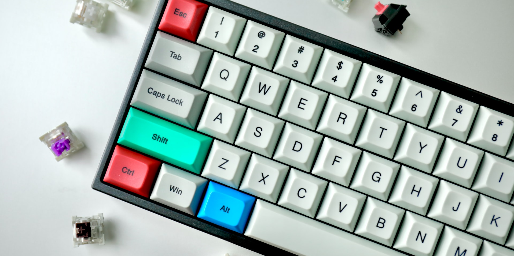

# Pi Pico Macro Keyboard

This repository contains code for DIY Macro Keyboards using the Raspberry Pi Pico and CircuitPython.

Note: This code does not include row-scanning. All buttons have to be connected to an individual GPIO Pin.

## Install:
1. Install CircuitPython on the pi pico (guide: https://learn.adafruit.com/getting-started-with-raspberry-pi-pico-circuitpython/circuitpython).
The Pi Pico will now show up as a "CircuitPython" USB drive

2. Install the adafruit_hid library by downloading the library bundle as stated here (https://circuitpython.org/libraries). Unzip and copy the "lib/adafruit_hid" folder into the "lib" folder on your Pi Pico

3. Copy the contents of "makrokeyboard.py" from the Repository into the existing "code.py" file on your Pi Pico

## Customization:
Edit the "code.py" file on the Pi Pico by opening it in a text editor.

To add/change Keys and the pins of the keys, edit the "keymap" and "pins" list.
Note that the first entry of the "pins" list corresponds to the first entry of the "keymap" list, and so on.

## Credits
This project is inspired by the adafruit custom keyboard guide.
Check it out if you need a more detailed guide:
https://learn.adafruit.com/diy-pico-mechanical-keyboard-with-fritzing-circuitpython/overview

The code of the guide should be interchangeable with the code from this repo (although not tested)

Title Image:
https://unsplash.com/photos/ZByWaPXD2fU
